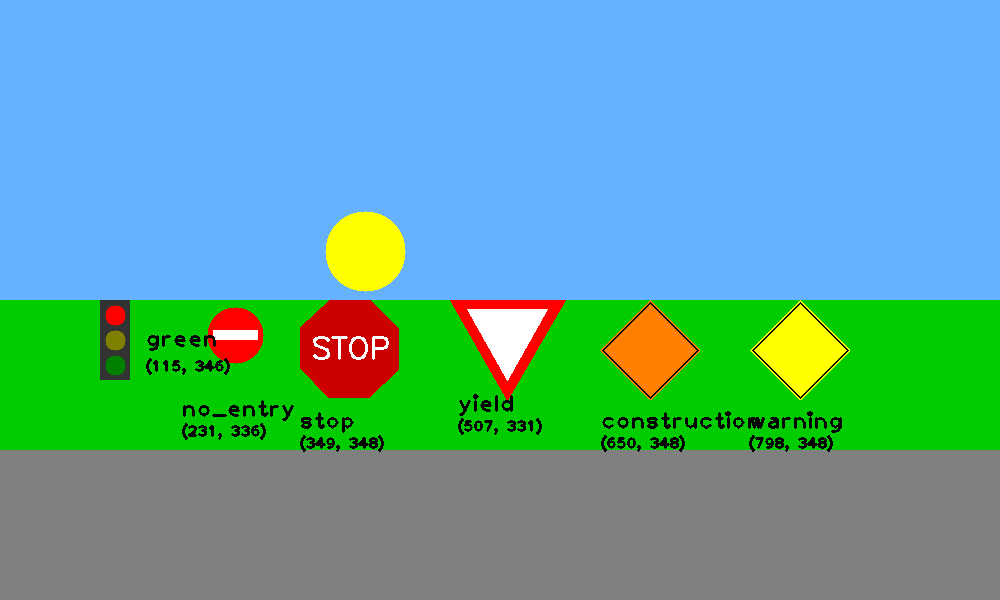
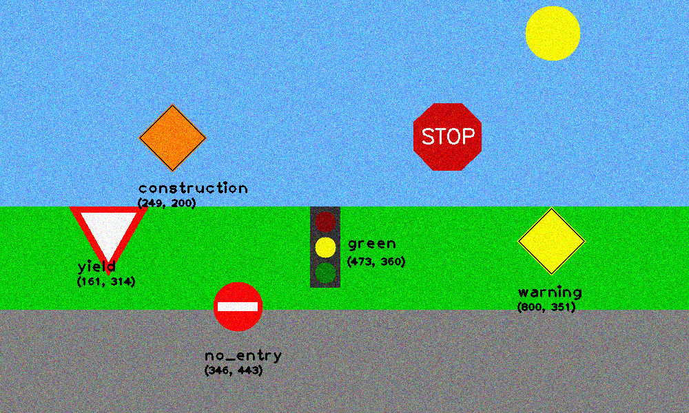

# Traffic Sign detection using hough transforms
In this project, I attempted to detect traffic signs using hough transforms.

##Instructions to run the code:
	1) run experiment.py
	
## sample output

